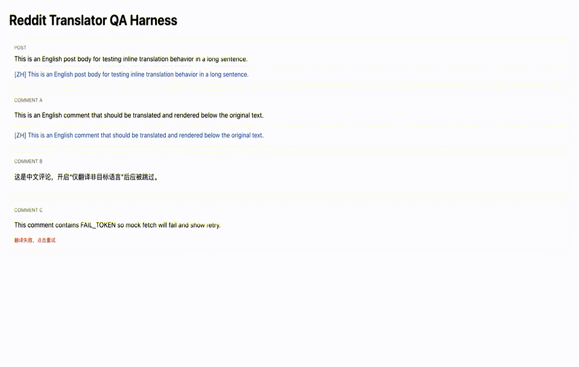

# Reddit Translator Free

A free and open-source browser extension prototype that translates Reddit post content and comment threads inline.

## Install Demo

## Features

- Enable/disable switch
- Target translation language selector
- Auto reload active page after target language changes
- Optional: translate only non-target-language text
- Translation font color customization
- Translation font size customization
- Automatically translates Reddit home/list feed post titles and post bodies
- Automatically translates post body and comment thread, then shows translated text below original content
- Minimal debug stats in popup (candidates, translated, failed, queue, cache)
- Quick links in popup:
  - Telegram contact
  - Extension review page

## Tech Notes

- No LLM API required
- Uses Google Translate endpoint for translation requests
- Optimized for Reddit desktop web (`reddit.com`)

## Local Run

1. Open Chrome -> `chrome://extensions/`
2. Enable "Developer mode"
3. Click "Load unpacked"
4. Select this project directory
5. Open Reddit home (`https://www.reddit.com/`) or a post page (`/r/.../comments/...`) for testing

## Suggested QA

1. Open a post with many comments and verify translations appear progressively for visible and scrolled content
2. Set target language to Chinese and enable "only translate non-target language", then verify Chinese text is skipped
3. Change translation color/size and verify style updates immediately
4. Click "Refresh Stats" in popup and verify stats are updated

## Known Limitations

- Prototype selectors may break if Reddit DOM structure changes
- Google Translate endpoint is an external dependency and may be unstable
- Primarily optimized for desktop Reddit web UI
