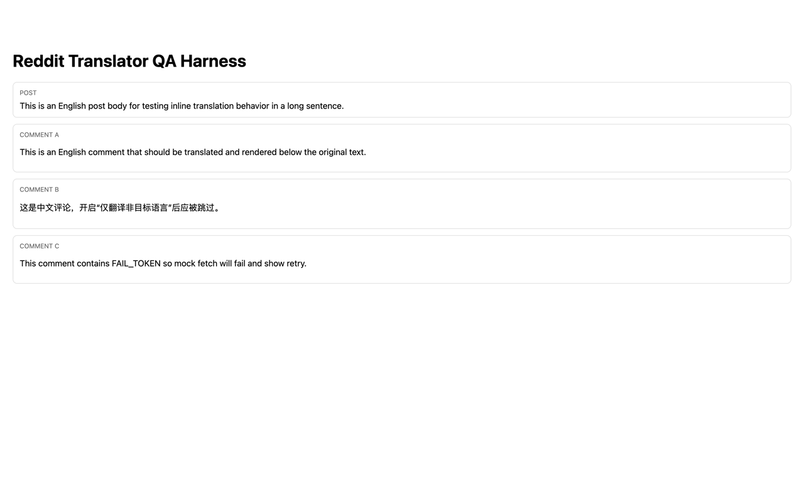

# Reddit Translator Free

一个免费开源的 Reddit 网页翻译插件原型（Manifest V3）。

## 页面示例

## 功能

- 开关控制
- 目标翻译语言选择
- 切换目标语言后自动刷新当前页面
- 仅翻译非目标语言（可选）
- 译文字体颜色设置
- 译文字体大小设置
- 支持 Reddit 首页/列表页帖子标题与正文翻译
- 开启后自动翻译整条帖子 + 评论串，并在原文下方显示译文
- Popup 内置最小调试状态（候选节点、已翻译、失败、队列、缓存）
- Popup 快捷入口：
  - Telegram 联系方式
  - 插件评论页

## 技术说明

- 无需配置大模型 API
- 使用 Google Translate 接口进行翻译请求
- 面向 `reddit.com` 网页版（桌面视口）

## 本地运行

1. 打开 Chrome -> `chrome://extensions/`
2. 开启「开发者模式」
3. 点击「加载已解压的扩展程序」
4. 选择本目录
5. 打开 Reddit 首页（`https://www.reddit.com/`）或帖子页（`/r/.../comments/...`）测试

## 验收建议

1. 打开一个评论很多的帖子，观察是否“先可见区后续滚动区”逐步翻译
2. 把目标语言设为中文并开启“仅翻译非目标语言”，确认中文内容被跳过
3. 调整颜色和字号，确认已翻译内容样式即时更新
4. 在 popup 点击“刷新状态”，确认统计数据会变化

## 已知限制

- 当前为原型，DOM 选择器可能随 Reddit 页面结构变化而失效
- Google 翻译接口属于外部依赖，稳定性不保证
- 仅针对桌面网页版优先优化
